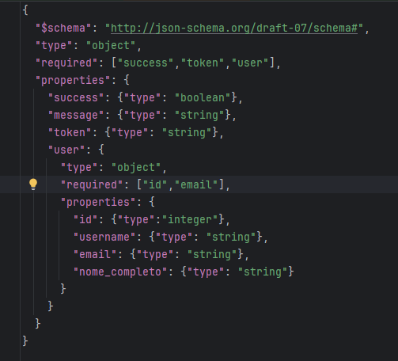

# 🕹️ GameStore API Tests

Suite de testes automatizados das APIs da plataforma GameStore, utilizando Rest Assured, JUnit 5, Allure Reports e integração com CI/CD.

## 🧩 Tecnologias & Bibliotecas

- Java 17
- Maven
- Rest Assured
- JUnit 5
- Allure Reports
- GitHub Actions (CI/CD)

## 📦 Instalação
Pré-requisitos
-Java 17 instalado
-Maven instalado
-Git 

# 🧩 Dependências para Executar os Testes Localmente

**Importante**: Este projeto de automação testa a aplicação GameStore real em execução local. Você precisa clonar dois repositórios e iniciar o servidor do GameStore antes de rodar os testes.

**Requisitos locais**
- Java 17 (para o projeto de testes)
- Maven (para o projeto de testes)
- Node.js 18+ (para o back-end/front-end do GameStore)
- Git
- Docker & Docker Compose (opcional, recomendado para Postgres)

## 1️⃣ Clonar e rodar o projeto REAL (GameStore – Front + Back + PostgreSQL)

Este é o sistema completo que será testado.

```
git clone https://github.com/JoaoPauloQA/ProjetoGameStore
cd gamestore

Instalar dependências e iniciar (modo local)

- npm install

O banco PostgreSQL já está hospedado no Railway, então não precisa instalar Postgres localmente.

Inicie o servidor :

- node server.js

A aplicação deve estar disponível em:

http://localhost:8080

Banco de dados (PostgreSQL)

```

## 2️⃣ Clonar este projeto de automação (API Tests – Rest Assured)

Com o servidor rodando, agora sim clone o projeto de testes:

```

git clone https://github.com/JoaoPauloQA/REST-Assured-Automation

```

📌 Observações Importantes

- ✔ Os testes fazem chamadas reais para sua API real
- ✔ O banco de dados e o back-end precisam estar funcionando
- ✔ O CI/CD pode usar uma URL pública (se você tiver deploy)
- ✔ Localmente é obrigatório rodar o projeto GameStore primeiro

## 🔧 Endpoints Testados
## 🕹️ Games

- GET	/api/games
- GET	/api/jogos/recomendado
- GET	/api/games/count
- GET	/api/gamepass
- GET	/api/top-played
- GET	/api/rawg-games
- GET	/api/games/popular
- GET	/api/games/:id/details
## 👤 Autenticação

- POST	/api/auth/register
- POST	/api/auth/login
- POST	/api/auth/refresh
- GET	/api/auth/verify
- GET	/api/user/me
## 🛒 Checkout & Account

- POST	/api/checkout
- GET	/api/account/:id
- GET	/api/orders/user/:id

## 🔍 Validações e Testes de Contrato (Schema Validation)

Além de testes funcionais, o projeto também implementa testes de contrato para garantir que as respostas da API sigam exatamente o formato esperado.

Os testes de contrato incluem:

- ✔ Validação de schema (JSON Schema Validation)
- ✔ Tipos de dados corretos (string, boolean, array, number, object)
- ✔ Campos obrigatórios presentes
- ✔ Estrutura da resposta consistente
- ✔ Garantia de que alterações indevidas no back-end sejam detectadas
- ✔ Prevenção de breaking changes

- 

## 🔍 Allure Reports

Allure  configurado para:

Allure configurado para:

- ✔ Gerar relatórios de testes automatizados
- ✔ Armazenar os artefatos de execução (allure-results) gerados via Maven
- ✔ Facilitar a análise de cenários, status dos testes e evidências
- ✔ Apoiar a documentação e apresentação dos testes no portfólio

- Exemplo de relatório:


 ## 📁 Estrutura do Projeto

A automação está organizada seguindo boas práticas de testes de API com Rest Assured, separando autenticação, payloads, configurações, validações e factories.

```
src
├── test
│   ├── java
│   │   ├── auth
│   │   ├── checkout
│   │   ├── config
│   │   ├── factories
│   │   ├── games
│   │   ├── payloads
│   │   ├── utils
│   │   └── validators
│   └── resources
│       └── schemas
│           ├── login-success.schema.json
│           ├── login-error.schema.json
│           ├── refresh-success.schema.json
│          
```
  
## 👨‍💻 Autor
**João Paulo QA**  
QA Automation Engineer | Test Automation Enthusiast  
LinkedIn https://www.linkedin.com/in/jo%C3%A3o-paulo-6a1b3a207/
